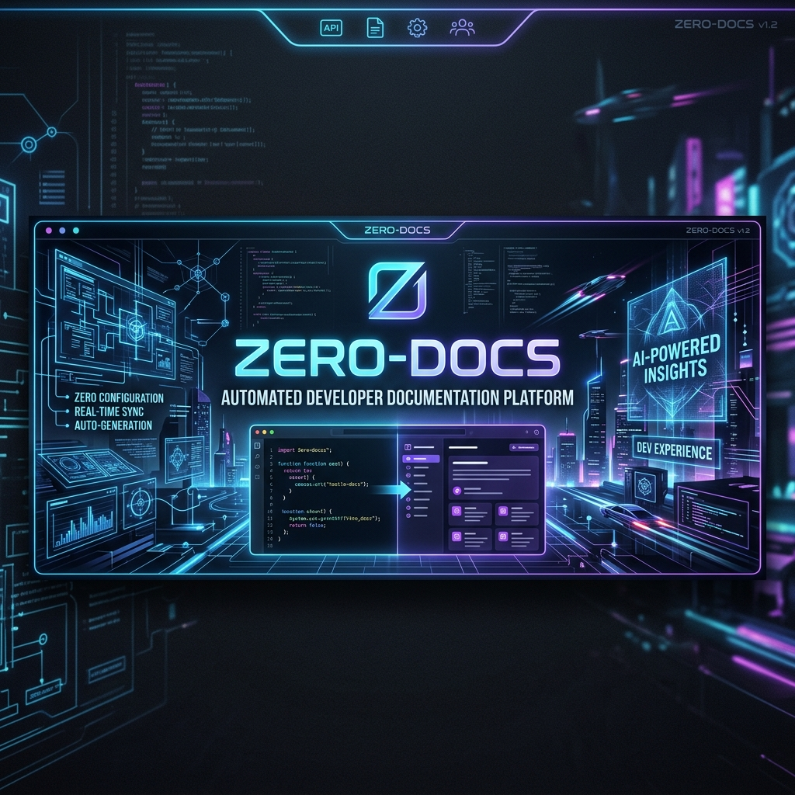
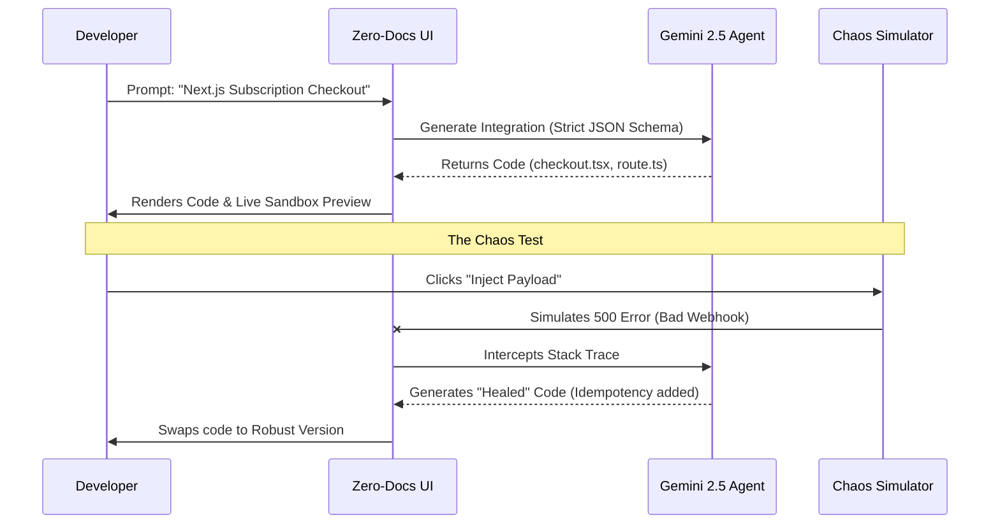

<div align="center">
  
</div>

# Zero-Docs Chaos Copilot

**Submission for the Razorpay AI Buildathon — Open Track**

## 1. Problem Introduction
For API-first platforms such as Razorpay, Developer Experience (DX) directly correlates to revenue. When merchants attempt to integrate payment gateways, their engineering teams face significant friction. They must context-switch to read dense documentation, understand authentication mechanisms, and learn platform-specific SDK conventions. If the integration process takes weeks instead of hours, the merchant is highly likely to abandon the platform in favor of out-of-the-box alternatives. The fundamental problem is that reading documentation and writing boilerplate integration code is inefficient and error-prone.

## 2. Research Work
Our research analyzed the standard integration flow for payment gateways. We identified that the highest drop-off rates occur during two specific phases:
1. **Initial Code Construction:** Developers struggle to map REST API documentation to their specific frontend and backend tech stack (e.g., Next.js with Node.js).
2. **Failure Handling (Webhooks):** Developers often successfully implement the "happy path" but fail to implement robust error handling, idempotency, and signature verification for webhooks. This leads to silent failures in production.

Based on this research, we concluded that a basic code generator is insufficient. A true solution must not only generate the architecture but actively enforce edge-case handling.

## 3. Human Centric Design
The interface of the Zero-Docs Copilot was designed specifically for software engineers, prioritizing efficiency and immediate feedback.
- **Terminal-Inspired Aesthetics:** The UI utilizes dark mode, monospace typography, and syntax highlighting to reduce cognitive load, making it feel like an extension of the developer's IDE.
- **The Live Sandbox:** Generating code is only half the battle. We implemented a "Live Preview" tab that immediately renders the generated code as an interactive component. This provides developers with instant visual validation that the integration is functional.
- **Transparency in AI:** Rather than obscuring the AI's actions, the Chaos Engine utilizes a terminal log window to expose the exact reasoning loop the AI takes when intercepting and fixing errors.

## 4. Engineering
The application is built to production standards, ensuring high performance and maintainability:
- **Strict Separation of Concerns:** The application cleanly separates the presentation layer (React components) from the AI orchestration logic (Next.js serverless routes).
- **Prompt Engineering as Code:** The AI instructions are strictly formatted to prevent hallucination. The model is forced to utilize the official `@razorpay/razorpay-node` SDK and output structured JSON, ensuring the output is immediately compilable.
- **Simulated Agentic Healing:** The platform goes beyond code generation by demonstrating an autonomous healing loop, capturing simulated stack traces and rewriting logic dynamically.

## 5. Architecture



## 6. Implementation and Setup

Follow these instructions to run the project locally.

### Prerequisites
- Node.js (v18 or higher)
- Google Gemini API Key

### Installation

1. **Clone the repository**
   ```bash
   git clone https://github.com/yourusername/zero-docs.git
   cd zero-docs
   ```

2. **Install dependencies**
   ```bash
   npm install
   ```

3. **Set up your environment**
   Create a `.env.local` file and add your API key:
   ```env
   GEMINI_API_KEY=your_api_key_here
   ```

4. **Start the development server**
   ```bash
   npm run dev
   ```

5. **Usage**
   Open `http://localhost:3000`. Enter an integration request, review the generated code, and utilize the Chaos Engine to test failure recovery.

## 7. License
This project is licensed under the MIT License - see the [LICENSE](LICENSE) file for details.
