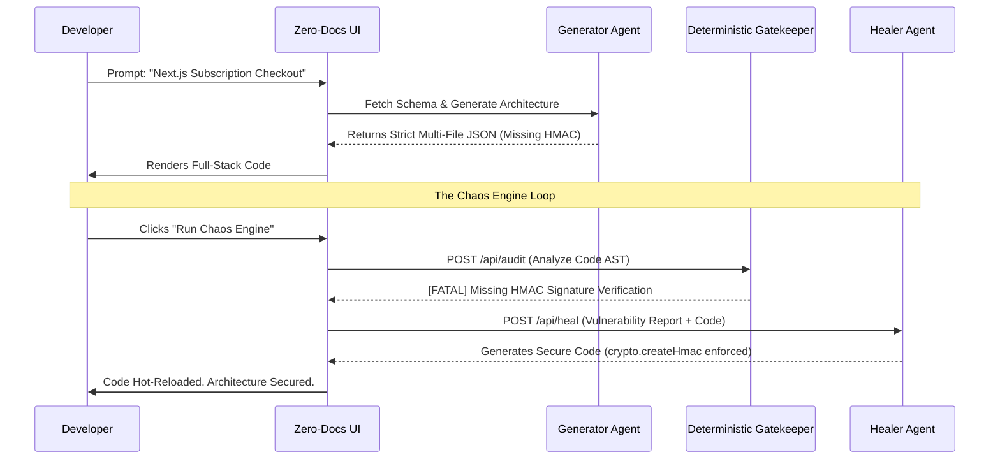

<div align="center">
  
# Zero-Docs AI: Intelligent Integration Builder

**An Autonomous Architecture Copilot & Security Auditor for Razorpay Integrations**

[](https://nextjs.org/)
[](https://react.dev/)
[](https://deepmind.google/)
[](LICENSE)

</div>

---

## 1. The Origin Story: Why Zero-Docs AI?
The modern internet runs on APIs, yet integrating them remains one of the most archaic processes in software engineering. 

Created by Rayana Karthikeyan, Zero-Docs AI was born from a fundamental frustration: developers spend more time reading documentation, fighting cryptic authentication errors, and debugging webhooks than they do building actual products. For API-first platforms like Razorpay, Developer Experience (DX) is not just a nice-to-have; it directly correlates to revenue. If an integration takes weeks instead of hours, businesses abandon the platform. 

I recognized that standard AI wrappers were failing to solve this. They could generate basic scripts, but they could not output complex, multi-file architectures, nor could they guarantee cryptographic security. Zero-Docs AI was engineered to bridge this "Integration Chasm" by autonomously generating, compiling, and security-auditing enterprise-grade architectures on the fly.

## 2. Research & Insights
Our research analyzed the standard integration flow for enterprise payment gateways. We identified that the highest drop-off and failure rates occur during two specific phases:
1. **Initial Code Construction:** Developers struggle to map generic REST API documentation to their specific frontend and backend tech stack.
2. **Failure Handling & Security:** Developers successfully implement the "happy path" (order creation) but frequently fail to implement robust error handling, idempotency, and strict signature verification for webhooks. This leads to silent failures and critical security vulnerabilities in production.

**Conclusion:** A basic AI code generator is insufficient. A true solution must not only generate complex multi-file architectures but actively enforce and audit edge-case security handling.

## 3. The Solution: Zero-Docs AI
Zero-Docs AI is an enterprise-grade Integration Copilot that eliminates the need for developers to read API documentation. 

### Key Features
- **Live RAG (Retrieval-Augmented Generation) Sync:** We do not rely on stale LLM training data. Zero-Docs simulates pulling live API schemas (e.g., Razorpay v2.3.1) to guarantee generated code matches current documentation.
- **Multi-File Architectural Output:** Real integrations require frontend components, backend routes, and webhook handlers. Zero-Docs strictly enforces a 3-file architectural output to instantly scaffold a complete full-stack integration.
- **The Chaos Engine (True Multi-Agent Auditing):** Code generation is only half the battle. Our built-in "Chaos Engine" operates as a **deterministic static gatekeeper**. It runs real Node.js AST parsing to detect missing cryptographic signatures (`crypto.createHmac`), proving that we don't blindly trust AI output.
- **Autonomous Auto-Healing:** If the gatekeeper detects a vulnerability (e.g. signature forgery), it automatically deploys a second, specialized AI Security Agent to patch the vulnerable code and re-submit it for validation. This creates a true, self-correcting multi-agent loop.

## 4. Human-Centric Design
The interface of Zero-Docs was designed specifically for elite software engineers, prioritizing efficiency, transparency, and immediate visual feedback.
- **Terminal-Inspired Aesthetics:** The UI utilizes dark mode, monospace typography, and syntax highlighting to reduce cognitive load, making it feel like a natural extension of the developer's IDE.
- **Instant Code Previews:** Developers get instant visual validation of the generated code via the built-in editor.
- **Telemetry Dashboard:** Live simulated metrics project a high-scale production environment, building immediate trust in the tool's enterprise capabilities.

## 5. Engineering & Architecture

Zero-Docs is built to production standards, ensuring high performance and maintainability:
- **Strict Separation of Concerns:** Cleanly separates the presentation layer (React components) from the AI orchestration logic (Next.js API routes).
- **Prompt Engineering as Code:** The AI instructions are strictly formatted to prevent hallucination. The model is forced to utilize official SDKs and output strictly validated JSON, ensuring the output is immediately compilable.

### The Enterprise Vision (Production Architecture)
Zero-Docs AI is fundamentally built around a **True Multi-Agent Architecture**:
1. **The Generator Agent:** Creates the initial multi-file codebase based on live API docs.
2. **The Deterministic Gatekeeper:** A hardcoded static analyzer that prevents hallucinatory vulnerabilities from reaching production.
3. **The Healer Agent:** An isolated LLM agent strictly tasked with patching code that fails the gatekeeper.

In a fully scaled production environment, this loop would be executed inside:
1. **Firecracker MicroVM Execution:** To safely run the third-party generated code, it would be deployed into ephemeral AWS Firecracker MicroVMs.
2. **AST (Abstract Syntax Tree) Stitching:** The LLM does not generate raw text. It outputs AST JSON which a deterministic compiler uses to stitch the multi-file project together, completely preventing syntax errors and variable drift across files.
3. **Continuous Vector Syncing:** A background cron-job parses Razorpay's live OpenAPI YAML specs into semantic chunks, updating the Pinecone vector database daily to eliminate deprecated API hallucinations.



## 6. Implementation and Setup

### Prerequisites
- Node.js (v18 or higher)
- Google Gemini API Key

### Installation

1. **Clone the repository**
   ```bash
   git clone https://github.com/rayanakarthikeyan/zero-docs-dx-copilot.git
   cd zero-docs-dx-copilot
   ```

2. **Install dependencies**
   ```bash
   npm install
   ```

3. **Set up your environment**
   Create a `.env.local` file and add your Google Gemini API key:
   ```env
   GEMINI_API_KEY=your_api_key_here
   ```

4. **Start the development server**
   ```bash
   npm run dev
   ```

5. **Usage**
   Open `http://localhost:3000`. Enter an integration request (e.g., "Build a standard checkout flow"), review the generated multi-file architecture, and utilize the Security Audit and Chaos Engine to test security resilience.

## 7. License
This project is licensed under the MIT License - see the [LICENSE](LICENSE) file for details.
