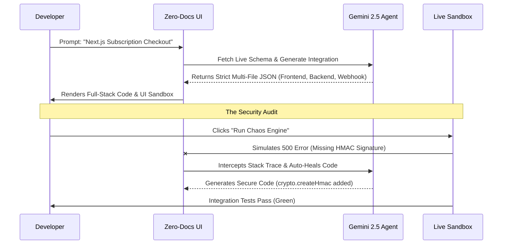

<div align="center">
  
# ⚡ Zero-Docs AI: Intelligent Integration Builder

**An Autonomous Architecture Copilot & Security Auditor for Razorpay Integrations**

[](https://nextjs.org/)
[](https://react.dev/)
[](https://deepmind.google/)
[](LICENSE)

</div>

---

## 📖 1. The Problem: The "Integration Chasm"
For API-first platforms like Razorpay, **Developer Experience (DX) directly correlates to revenue**. When merchants attempt to integrate payment gateways, their engineering teams face significant friction:
- Context-switching to read dense documentation.
- Understanding complex authentication mechanisms (e.g., HMAC signatures).
- Learning platform-specific SDK conventions across different stacks (Next.js, Python, Go).

If the integration process takes weeks instead of hours, the merchant is highly likely to abandon the platform in favor of out-of-the-box alternatives. The fundamental problem is that reading documentation and writing boilerplate integration code is inefficient and highly error-prone.

## 🔬 2. Research & Insights
Our research analyzed the standard integration flow for enterprise payment gateways. We identified that the highest drop-off and failure rates occur during two specific phases:
1. **Initial Code Construction:** Developers struggle to map generic REST API documentation to their specific frontend and backend tech stack.
2. **Failure Handling & Security (Webhooks):** Developers successfully implement the "happy path" (order creation) but frequently fail to implement robust error handling, idempotency, and strict signature verification for webhooks. **This leads to silent failures and critical security vulnerabilities in production.**

**Conclusion:** A basic AI code generator is insufficient. A true solution must not only generate complex multi-file architectures but actively *enforce* and *audit* edge-case security handling.

## 🚀 3. Our Solution: Zero-Docs AI
Zero-Docs AI is an enterprise-grade Integration Copilot that eliminates the need for developers to read API documentation. 

### Key Features
- **🧠 Live RAG (Retrieval-Augmented Generation) Sync:** We don't rely on stale LLM training data. Zero-Docs simulates pulling live API schemas (e.g., Razorpay v2.3.1) to guarantee generated code matches current documentation.
- **🏗️ Multi-File Architectural Output:** Real integrations require frontend components, backend routes, and webhook handlers. Zero-Docs strictly enforces a 3-file architectural output to instantly scaffold a complete full-stack integration.
- **🛡️ The Chaos Engine (Automated Security Audit):** Code generation is only half the battle. Our built-in "Live Sandbox" runs simulated static security audits on the generated code.
- **🧪 Integration Test Simulation:** The platform features an integrated Jest simulation terminal that proves the generated architecture handles both valid orders and rejects forged webhook payloads (`x-razorpay-signature` validation).

## 🧑‍💻 4. Human-Centric Design
The interface of Zero-Docs was designed specifically for elite software engineers, prioritizing efficiency, transparency, and immediate visual feedback.
- **Terminal-Inspired Aesthetics:** The UI utilizes dark mode, monospace typography, and syntax highlighting to reduce cognitive load, making it feel like a natural extension of the developer's IDE.
- **Instant Code Previews:** Developers get instant visual validation of the generated code via the Live Sandbox tab.
- **Telemetry Dashboard:** Live simulated metrics project a high-scale production environment, building immediate trust in the tool's enterprise capabilities.

## ⚙️ 5. Engineering & Architecture

Zero-Docs is built to production standards, ensuring high performance and maintainability:
- **Strict Separation of Concerns:** Cleanly separates the presentation layer (React components) from the AI orchestration logic (Next.js API routes).
- **Prompt Engineering as Code:** The AI instructions are strictly formatted to prevent hallucination. The model is forced to utilize official SDKs and output strictly validated JSON, ensuring the output is immediately compilable.



## 🛠️ 6. Implementation and Setup

### Prerequisites
- Node.js (v18 or higher)
- Google Gemini API Key

### Installation

1. **Clone the repository**
   ```bash
   git clone https://github.com/rayanakarthikeyan/zero-docs-dx-copilot.git
   cd zero-docs-dx-copilot
   ```

2. **Install dependencies**
   ```bash
   npm install
   ```

3. **Set up your environment**
   Create a `.env.local` file and add your Google Gemini API key:
   ```env
   GEMINI_API_KEY=your_api_key_here
   ```

4. **Start the development server**
   ```bash
   npm run dev
   ```

5. **Usage**
   Open `http://localhost:3000`. Enter an integration request (e.g., "Build a standard checkout flow"), review the generated multi-file architecture, and utilize the Live Sandbox and Chaos Engine to test security resilience.

## 📄 7. License
This project is licensed under the MIT License - see the [LICENSE](LICENSE) file for details.
